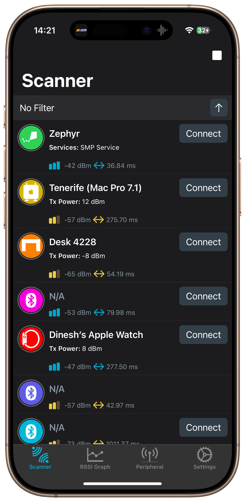
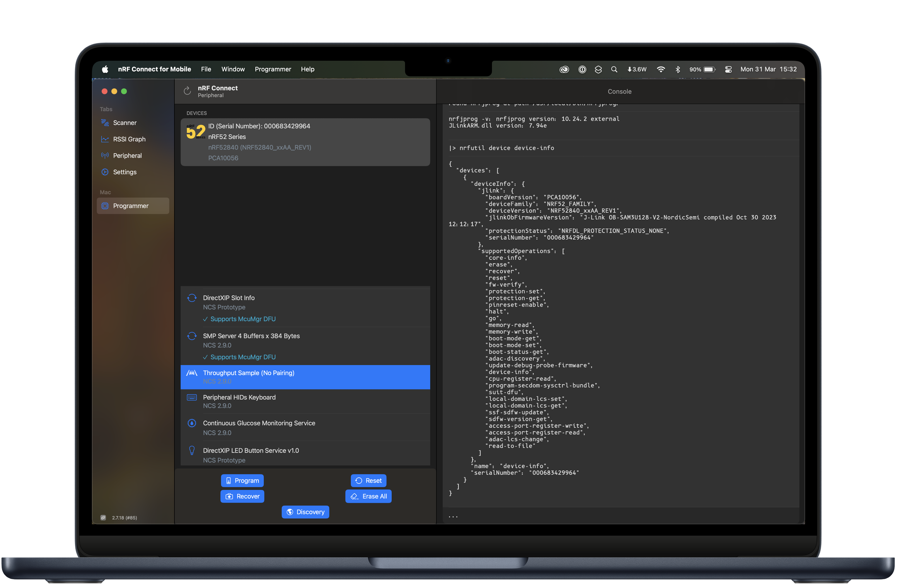

# nRF Connect for iOS

> [!NOTE]  
> This repository does not hold the source code of nRF Connect for Apple platforms. It is a public repository used to submit any issues and/or feedback.

## Supported Devices

| | iOS | iPadOS | macOS |
| :---: | :---: | :----: | :----: |
| |  |  |  |
| Minimum Version | iOS 16.0 | iPadOS 16.0 | macOS 13.0 |
| Exclusive Features | N/A | N/A | Programmer Tab, File Manager Tab (rough edges), Serial Terminal (very Alpha), Extended System Information |
| Notes | N/A | There are no exclusive features available to the iPad per se, but we strive for nRF Connect to perform as a 'native citizen'. So there's support for multiple app sizes, SlideOver, and so on. | We have done it! You can now run nRF Connect natively on your Mac! It is rough and far from perfect, but you can run it, too. |
| Distribution | [App Store](https://apps.apple.com/us/app/nrf-connect-for-mobile/id1054362403) | [App Store](https://apps.apple.com/us/app/nrf-connect-for-mobile/id1054362403) | [Self-Distribution](https://github.com/NordicSemiconductor/IOS-nRF-Connect/raw/refs/heads/readme/Releases/nRF-Connect-2-7-18-b85.dmg) [(see GitHub Releases Folder)](https://github.com/NordicSemiconductor/IOS-nRF-Connect/tree/readme/Releases)

## Project history

This project started at end of 2015, with the aim is to make a comprehensive Bluetooth tool for both firmware developers and App developers. This development train lead to the release of version 1.8.8 in September 2018, at which point development was rebooted from scratch, culminating in the release of the all-new nRF Connect 2.0 on August 19th, 2019. Since then, this 2.0 version has become the basis of all our development efforts for Apple platforms.

## Features

The current version nRF Connect (formerly known as "nRF Master Control Panel"), includes the following features:
- BLE Device Scanning, and comprehensive filtering solutions
- RSSI Graph View of scanned devices
- Connects to any connectable the Bluetooth Smart device
- Service, Characteristic and Descriptor Discovery
- Read and Write Characteristic(s) and Descriptors
- Enable and Disable Notifications and Indications
- Logs for Bluetooth related events and method calls
- Seamless Device Firmware Update, with support for 'Nordic', McuMgr and SUIT DFU
- Parses Apple and Google beacons
- Advertising as a BLE Peripheral
- Import Files via Drag & Drop, or Open from External Sources (iCloud, etc.)
- System Information
- [Online Service & Characteristic Repository](https://github.com/NordicSemiconductor/bluetooth-numbers-database), updated on app startup.

## Roadmap

Please keep in mind that the following is representative of the team's intentions, and in no way should be taken as final. Priorities change, as well as unexpected issues & bugs we might decide are more important and need our immediate attention.

Version 2.8:
- Rewrite of Client / Server Screens in Device Details

Version 2.9:
- Full 'Scanner' Rewrite

Ongoing:
- Keep making 'Mac' version of nRF Connect fit better on the Mac.
- Continue our work on low-level performance optimisations
- (Fun item) New shaders!

## Development

Early on after the release of version 2.0, we published a few blog posts regarding its [full feature set](https://devzone.nordicsemi.com/nordic/nordic-blog/b/blog/posts/announcing-nrf-connect-2-0-for-ios), the amount of [work and detail we pour into a bug-fix release](https://devzone.nordicsemi.com/nordic/nordic-blog/b/blog/posts/nrf_2d00_connect_2d00_ios_2d00_2_2d00_0_2d00_3_2d00_what_2d00_is_2d00_a_2d00_bugfix_2d00_release), and [our transition to Dark Mode in 2.1](https://devzone.nordicsemi.com/nordic/nordic-blog/b/blog/posts/nrf_2d00_connect_2d00_ios_2d00_dark_2d00_mode).

Since then, we've transitioned towards blogging less-often, but attempting to offer a unique perspective focused more on using all the development tools at our disposal to extract more performance out of iOS hardware:
- [SIMD Optimizations in Swift](https://devzone.nordicsemi.com/nordic/nordic-blog/b/blog/posts/nrf_2d00_connect_2d00_simd_2d00_optimizations_2d00_in_2d00_swift)
- [From a BitField Collection in Swift downto x86 Assembly](https://devzone.nordicsemi.com/nordic/nordic-blog/b/blog/posts/on-nrf-connect-for-ios-and-its-unnecessary-bitfield-collection-in-swift)
- [On nRF Connect for Mobile 2.5, and performance as the root of all... benefit?](https://devzone.nordicsemi.com/nordic/nordic-blog/b/blog/posts/on-nrf-connect-2-5-and-performance-as-the-root-of-all-benefit)
- [On nRF Connect for the Mac, the new nRF Edge Impulse and the Discovery of SwiftUI](https://devzone.nordicsemi.com/nordic/nordic-blog/b/blog/posts/on-nrf-edge-impulse-and-the-discovery-of-swiftui)

[Note to self: Jesus, we haven't written anything in a while.]

But you're probably not in this section to read blogs, even though some of them do contain snippets of actual nRF Connect code. Our stance regarding sharing the innards of nRF Connect has not changed, and we're keeping it closed source for now. If you're a developer working with [CoreBluetooth](https://developer.apple.com/documentation/corebluetooth) and are encountering issues, we'd be happy to help you. Just send us an email. But besides that, we have the [iOS-Common-Lib that we're slowly building up](https://github.com/NordicPlayground/IOS-Common-Libraries) and, there's code over there that we keep constantly pulling out of our most developed BLE app, which is naturally nRF Connect. The opposite also happens, but regardless, there is plenty of code iOS relies on that can be found over there. And if there's some soluton in particular you'd like more information on, we might just make it Open Source instead.

## Related Projects

- [iOS DFU/McuMgr Library](https://github.com/NordicSemiconductor/IOS-Pods-DFU-Library)
- [(Nordic) iOS Common Libraries](https://github.com/NordicPlayground/IOS-Common-Libraries)
- [nRF Connect for Android](https://github.com/NordicSemiconductor/Android-nRF-Connect)
- [Android DFU/McuMgr Library](https://github.com/NordicSemiconductor/Android-DFU-Library)
- [nRF Connect for Desktop GitHub Page](https://github.com/NordicSemiconductor/pc-nrfconnect-launcher)
